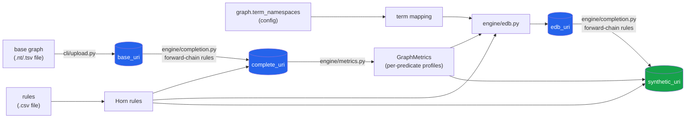
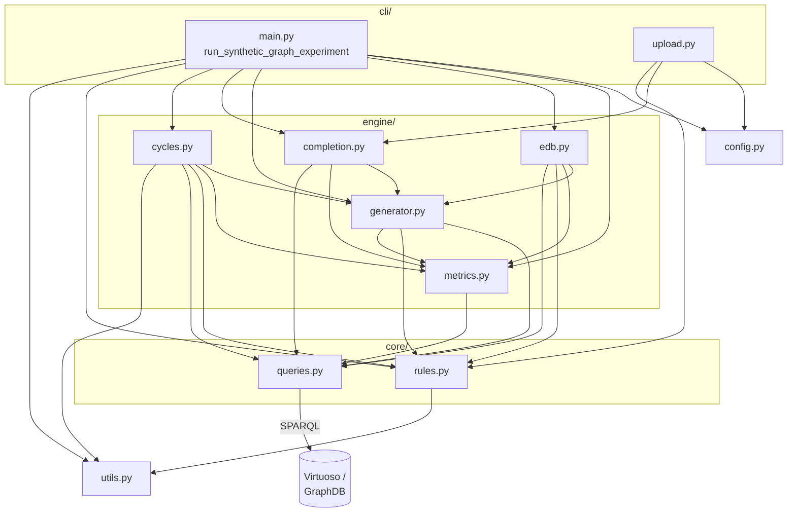

# Architecture

This is the deep-dive version of the module map in [`AGENTS.md`](../AGENTS.md) — read that first for the terse reference; come here for the "why" and diagrams. See [`concepts.md`](concepts.md) for definitions of the domain terms used below (EDB/IDB, Horn rule, closure, predicate profile, ...).

## Data flow

The pipeline turns a source graph into a synthetic copy in two stages: first it *completes* a base graph and profiles it, then it *regenerates* a graph from scratch using only those profiles and the rule set — never touching the original graph again once the profiles are extracted.

Blue nodes are named graphs in the database (keyed by the URIs in each config's `graph` section); the green node is the final deliverable.

1. **Upload** (`cli/upload.py`) loads a base `.nt` or `.tsv` file (`graph.triple_file`) into `base_uri`. `.tsv` rows are bare `subject\tpredicate\tobject` terms, resolved to full URIs via the term mapping before insertion.
2. **Completion** (`engine/completion.py`) forward-chains the rule set over `base_uri` — assuming rule bodies are fully grounded — until no rule adds any more triples, producing `complete_uri`. This is a *real* graph, used only to extract metrics from; it never ships as output.
3. **Metrics** (`engine/metrics.py`) profiles `complete_uri` over SPARQL: per-predicate frequency, domain/range distributions, reflexivity. This is the entire "topological description" the rest of the pipeline needs — from here on, the original graph is no longer touched.
4. **EDB generation** (`engine/edb.py`) synthesizes ground triples for *extensional* predicates (ones no rule head ever produces) that satisfy both the profiles and the rule bodies that reference them, producing `edb_uri`. See [`edb-generation.md`](edb-generation.md) for the full algorithm.
5. **Synthetic graph generation, as wired in `cli/main.py`.** The entry point logs five numbered phases: metrics/rules, EDB, completion, cycle-breaking, summary. Completion (`engine/completion.py`'s `complete_graph`, which returns the number of triples it added and takes a `label` for its log lines) forward-chains *every* rule over the EDB into `synthetic_uri` each pass, repeating until a pass adds nothing — there's no rule ordering and no profile budget applied during this loop (`apply_rule` is called without a `profile`, so a rule can in principle overshoot its head predicate's target frequency; only rule `support` and predicate `frequency` targets are checked afterward, via `engine/generator.py`'s `get_closed_rules`/`get_closed_preds`, to flip the `closed` fields used for reporting). Cycle-breaking then alternates `engine/cycles.py`'s `break_cycles` (seeds one [stale cycle](concepts.md#stale-cycle) per call) with another `complete_graph` pass until `break_cycles` seeds nothing more. (An earlier design, `engine/idb.py`'s `generate_idb`, forward-chained with explicit same-head rule ordering and an upfront inferrability check; it's no longer wired into the pipeline — see `docs/concepts.md`'s "Rule application order".)

## Components

- **`config.py`** — `RunConfig` and sub-configs (dataclasses), loaded from `configurations/*.json`. LoRA fine-tuning / Chain-of-Thought dataset generation from KGs isn't implemented under `src/` yet — see `notebooks/` for prototype work in that direction; placeholder `FineTuningConfig`/`CoTGenerationConfig` dataclasses for it were removed as dead code and should be reintroduced once that pipeline is actually built.
- **`utils.py`** — logging setup, `SPARQLWrapper` client construction, and term ↔ namespace mapping (parses `@prefix` declarations from a `.ttl` file without loading it into an RDF library).
- **`core/rules.py`** — `Atom`/`RuleSignature`/`HornRule` dataclasses, CSV parsing into a rule set, `get_extensional_dependencies` (the "more restrictive rule first" ordering EDB generation uses — see [`edb-generation.md`](edb-generation.md)), and `get_relation_graph`/`find_stale_cycles` (the predicate dependency graph `engine/cycles.py` scans for stale cycles).
- **`core/queries.py`** — every SPARQL query construction/execution function. Nothing outside this module talks to `SPARQLWrapper` directly for reads/writes. SELECTs are sent as POST (URL-encoded) rather than GET: `get_existing_triples` builds queries with large `VALUES` clauses that can exceed a GET request's max URL/header size and get rejected by the store's HTTP server. `TripleBuffer` wraps `insert_triples_sparql` to accumulate triples that were decided without a DB read (`engine/edb.py`'s direct-match/random-assignment steps) so they land in fewer, larger batches instead of one round trip per call — see [`edb-generation.md`](edb-generation.md).
- **`engine/metrics.py`** — `GraphMetrics`/`PredicateProfile`: the topological descriptors extracted from the source graph.
- **`engine/generator.py`** — shared triple-generation primitives. `sample_groundings` constructs groundings of a rule's extensional body directly from the predicate profiles (no materialized cartesian product); used by `engine/edb.py` and by `engine/cycles.py` (to seed a stale cycle's ungrounded body atoms). `apply_rule` — applying a single rule to produce new triples, querying only the real graph for bindings, and, when given a `profile`, checking whether a candidate assignment keeps the remaining profile realizable (`is_assignment_solvable`) — is used by `engine/completion.py` (always without a `profile`, so unconstrained by any target frequency there). `get_closed_rules`/`get_closed_preds` are the small SPARQL-backed checks for whether a rule/predicate has reached its `support`/`frequency` target, used by `engine/completion.py` and `cli/main.py`.
- **`engine/edb.py`** — see "Data flow" above.
- **`engine/completion.py`** — see "Data flow" above.
- **`engine/cycles.py`** — `break_cycles` runs right after completion in `cli/main.py`. It finds *stale cycles* (`core/rules.find_stale_cycles`), seeds one rule of one cycle in the synthetic graph via `sample_groundings` and returns (`cli/main.py` completes the graph and calls it again until it returns 0); see "Stale cycle" in `docs/concepts.md`.
- **`cli/main.py`** — the experiment entry point (`run_synthetic_graph_experiment`). After generation, `log_summary` logs one consolidated synthetic-vs-original report: total triples, one row per predicate (frequency original -> synthetic, `[OPEN]`/`[CLOSED]`, and `[EXTENSIONAL]`/`[INTENSIONAL]` — intensional means the predicate is the head of some rule) and one row per rule (support original -> synthetic, `[OPEN]`/`[CLOSED]`), with URIs shortened to their last segment and each rule printed as `body => head`.
- **`cli/upload.py`** — standalone script (edit the `graph_config` path at the top and run it directly) that uploads a base graph and runs completion.

## Known rough edges

See [`BACKLOG.md`](../BACKLOG.md) for the full, current list.
