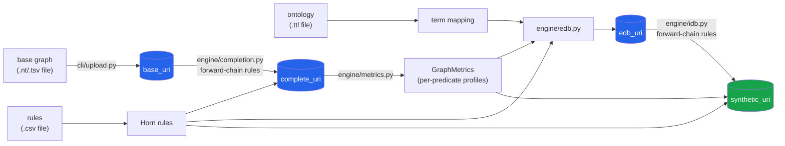
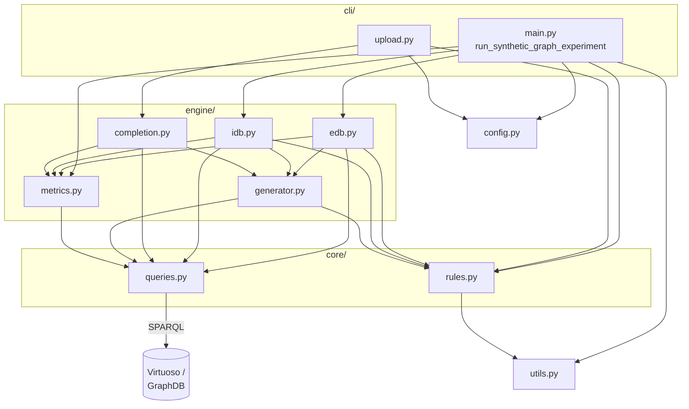

# Architecture

This is the deep-dive version of the module map in [`AGENTS.md`](../AGENTS.md) —
read that first for the terse reference; come here for the "why" and diagrams.
See [`concepts.md`](concepts.md) for definitions of the domain terms used below
(EDB/IDB, Horn rule, closure, predicate profile, ...).

## Data flow

The pipeline turns a source graph into a synthetic copy in two stages: first it
*completes* a base graph and profiles it, then it *regenerates* a graph from
scratch using only those profiles and the rule set — never touching the original
graph again once the profiles are extracted.

Blue nodes are named graphs in the database (keyed by the URIs in each config's
`graph` section); the green node is the final deliverable.

1. **Upload** (`cli/upload.py`) loads a base `.nt` or `.tsv` file (`graph.triple_file`)
   into `base_uri`. `.tsv` rows are bare `subject\tpredicate\tobject` terms,
   resolved to full URIs via the ontology term mapping before insertion.
2. **Completion** (`engine/completion.py`) forward-chains the rule set over
   `base_uri` — assuming rule bodies are fully grounded — until no rule adds any
   more triples, producing `complete_uri`. This is a *real* graph, used only to
   extract metrics from; it never ships as output.
3. **Metrics** (`engine/metrics.py`) profiles `complete_uri` over SPARQL:
   per-predicate frequency, domain/range distributions, reflexivity. This is
   the entire "topological description" the rest of the pipeline needs — from
   here on, the original graph is no longer touched.
4. **EDB generation** (`engine/edb.py`) synthesizes ground triples for
   *extensional* predicates (ones no rule head ever produces) that satisfy both
   the profiles and the rule bodies that reference them, producing `edb_uri`.
   See [`edb-generation.md`](edb-generation.md) for the full algorithm.
5. **IDB generation** (`engine/idb.py`) forward-chains the rules again, this
   time starting from the EDB instead of a real graph, growing `synthetic_uri`
   until every rule/predicate reaches its target support/frequency (closure).
   Within each step, a rule only fires once every rule it *depends on* is
   closed: `core/rules.py`'s `get_intensional_dependencies` makes a rule
   depend on every other rule that shares its head predicate and is *more
   restrictive* (a bigger/more specific body — a strict superset of the
   dependent rule's body predicates; for recursive rules — head predicate
   also in the body — every non-recursive rule for that head counts as a
   dependency too). More restrictive rules are generated first, so a looser
   rule can't consume bindings/budget (the head predicate's remaining
   `frequency`/`support`) a stricter same-head rule still needs. This still
   holds under the "complete rules" assumption (`check_uninferrable_preds`'s
   upfront check, that every intensional predicate has *some* path back to
   extensional predicates, is unaffected — it never consults the dependency
   graph) — but it does mean *runtime* closure is now coupled to it: if a
   dependency rule itself never closes (no more bindings satisfy its body
   before its `support` target is met), every rule gated on it stays skipped
   indefinitely, and generation can reach a stale state with a
   structurally-derivable predicate still short of its target frequency.

## Components

- **`config.py`** — `RunConfig` and sub-configs (dataclasses), loaded from
  `configurations/*.json`. LoRA fine-tuning / Chain-of-Thought dataset
  generation from KGs isn't implemented under `src/` yet — see `notebooks/`
  for prototype work in that direction; placeholder `FineTuningConfig`/
  `CoTGenerationConfig` dataclasses for it were removed as dead code and
  should be reintroduced once that pipeline is actually built.
- **`utils.py`** — logging setup, `SPARQLWrapper` client construction, and term
  ↔ namespace mapping (parses `@prefix` declarations from a `.ttl` file without
  loading it into an RDF library).
- **`core/rules.py`** — `Atom`/`RuleSignature`/`HornRule` dataclasses, CSV
  parsing into a rule set, and rule-set-level checks (e.g.
  `check_uninferrable_preds` verifies every intensional predicate is actually
  derivable from the extensional ones before IDB generation starts, and
  `get_intensional_dependencies` builds the per-rule "must close first"
  dependency set consumed by `engine/idb.py`'s generation loop — see "Data
  flow" step 5).
- **`core/queries.py`** — every SPARQL query construction/execution function.
  Nothing outside this module talks to `SPARQLWrapper` directly for reads/writes.
  SELECTs are sent as POST (URL-encoded) rather than GET: `get_existing_triples`
  builds queries with large `VALUES` clauses that can exceed a GET request's
  max URL/header size and get rejected by the store's HTTP server.
- **`engine/metrics.py`** — `GraphMetrics`/`PredicateProfile`: the topological
  descriptors extracted from the source graph.
- **`engine/generator.py`** — shared triple-generation primitives.
  `create_searchspace` (cartesian product of a predicate's domain × range) is
  used only by `engine/edb.py`, to find candidate bindings for extensional
  predicates. `apply_rule` — applying a single rule to produce new triples,
  querying only the real graph for bindings, checking whether a candidate
  assignment keeps the remaining profile realizable
  (`is_assignment_solvable`) — is shared by `engine/idb.py` and
  `engine/completion.py`.
- **`engine/edb.py`** / **`engine/idb.py`** — see "Data flow" above.
- **`engine/completion.py`** — see "Data flow" above.
- **`cli/main.py`** — the experiment entry point (`run_synthetic_graph_experiment`).
- **`cli/upload.py`** — standalone script (edit the `graph_config` path at the
  top and run it directly) that uploads a base graph and runs completion.

## Known rough edges

See [`BACKLOG.md`](../BACKLOG.md) for the full, current list.
