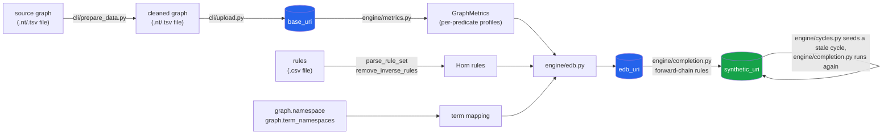
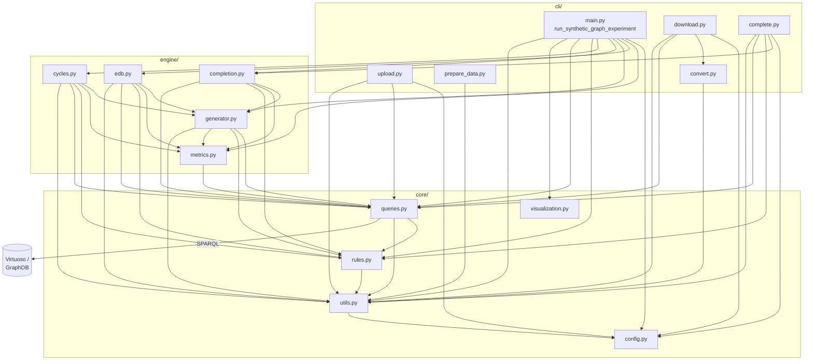

# Architecture

This page expands the module map in [`AGENTS.md`](../AGENTS.md) with diagrams and the reasons behind the design. [`concepts.md`](concepts.md) defines the domain terms used below (EDB/IDB, Horn rule, closure, predicate profile, ...), and [`algorithm.md`](algorithm.md) describes the method independently of the code.

## Data flow

The pipeline turns a source graph into a synthetic one in two stages. It first profiles the uploaded base graph, then builds a new graph from those profiles and the rule set alone. Once the profiles are extracted, the original graph is not read again.

```mermaid
flowchart LR
    RAW["source graph<br/>(.nt/.tsv file)"] -->|cli/prepare_data.py| NT["cleaned graph<br/>(.nt/.tsv file)"]
    NT -->|cli/upload.py| BASE[("base_uri")]
    NS["graph.namespace<br/>graph.term_namespaces"] --> TERM["term mapping"]
    RULES["rules<br/>(.csv file)"] -->|"parse_rule_set<br/>remove_inverse_rules"| HORN["Horn rules"]

    BASE -->|engine/metrics.py| METRICS["GraphMetrics<br/>(per-predicate profiles)"]

    METRICS & HORN & TERM --> EDBGEN["engine/edb.py"]
    EDBGEN --> EDB[("edb_uri")]

    EDB -->|"engine/completion.py<br/>forward-chain rules"| SYN[("synthetic_uri")]
    SYN -->|"engine/cycles.py seeds a stale cycle,<br/>engine/completion.py runs again"| SYN

    style BASE fill:#2563eb,color:#fff
    style EDB fill:#2563eb,color:#fff
    style SYN fill:#16a34a,color:#fff
```

Blue nodes are named graphs in the database, keyed by the URIs in each config's `graph` section. The green node is the synthetic graph the pipeline delivers.

1. Preparation (`cli/prepare_data.py`, optional and local). The pipeline does not support literals yet, so this script writes a cleaned copy of a `.nt`/`.tsv` file as both `<output>.tsv` and `<output>.nt`. It replaces every `/` in a term's own name with `_` (written as `%2F` inside an IRI's last segment) and fails if two terms clean to the same name. It drops duplicate triples, every non-type triple whose object is never typed (never the subject of a `type`/`rdf:type` triple), and every triple whose predicate is in `--literal-predicates` (default `name`). Type triples are always kept. It logs a warning for every subject that is never typed; DEBUG lists each one. `cli/convert.py` only converts a file between `.nt` and `.tsv`, keeping literals. Both scripts build the term mapping from `-f` or `--namespace` (`core/utils.load_term_mapping`) and never touch the database.
2. Upload (`cli/upload.py`). Loads a `.nt` or `.tsv` file (`graph.triple_file`) into `base_uri`, or into `--graph-uri` if given. `.tsv` rows are bare `subject\tpredicate\tobject` terms, resolved to full URIs through the term mapping before insertion.
3. Metrics and rules (phase 1 of `cli/main.py`). `engine/metrics.py` profiles `base_uri` over SPARQL: per-predicate frequency, domain and range counts, reflexivity. These profiles are all the pipeline needs from the source graph. The rule set is then parsed (`core/rules.parse_rule_set`, which keeps only rules with PCA confidence >= `pca_threshold`), and `core/rules.remove_inverse_rules` deletes the redundant rule of each isolated [inverse rule pair](concepts.md#inverse-rule-pair), so that its head predicate becomes extensional and the EDB generates it. `core/visualization.plot_relation_graph` writes the remaining rules' predicate dependency graph to `logs/relation_graph_<graph.name>.png`, with every predicate on a cycle drawn in red.
4. EDB generation (phase 2). `engine/edb.py`'s `generate_extensional_predicates` fills `edb_uri` with triples for the extensional predicates (those no rule head produces) until each one reaches its target frequency. It applies three mechanisms in a fixed priority: `check_direct_matches` adds the triples the profiles force, `check_triples_from_rule` builds groundings of each rule's extensional body with `generator.sample_groundings` so the joins the rules need exist, and `insert_random_triples` spends the remaining budget with draws weighted by each entity's remaining count. See [section 3 of `algorithm.md`](algorithm.md#3-extensional-database-edb) for the method. `--skip-edb` skips this phase and reuses the triples already at `edb_uri`.
5. Completion and cycle-breaking (phases 3 and 4). `engine/completion.py`'s `complete_graph` copies `edb_uri` into `synthetic_uri`, then applies every rule on each pass and repeats until a pass adds nothing. It returns the number of triples added and takes a `label` for its log lines. Rules are not ordered, and `apply_rule` is called without a `profile`, so a rule can overshoot its head predicate's target frequency. The profiles passed to `complete_graph` are only used afterwards: `engine/generator.py`'s `get_closed_rules`/`get_closed_preds` check which rules reached their `support` and which predicates reached their `frequency`, and set their `closed` fields for reporting. Cycle-breaking then alternates `engine/cycles.py`'s `break_cycles`, which seeds one [stale cycle](concepts.md#stale-cycle) per call, with another `complete_graph` pass until `break_cycles` seeds nothing. Phase 5 logs the summary (see `cli/main.py` below). An earlier design, `engine/idb.py`'s `generate_idb`, ordered rules with the same head and checked upfront that every intensional predicate could be derived; it has been removed (see [Rule application order](concepts.md#rule-application-order)).

## Components

```mermaid
flowchart TD
    subgraph cli ["cli/"]
        MAIN["main.py<br/>run_synthetic_graph_experiment"]
        UPLOAD["upload.py"]
        DOWNLOAD["download.py"]
        COMPLETE["complete.py"]
        PREPARE["prepare_data.py"]
        CONVERT["convert.py"]
    end

    subgraph engine ["engine/"]
        METRICS["metrics.py"]
        EDB["edb.py"]
        GEN["generator.py"]
        COMPLETION["completion.py"]
        CYCLES["cycles.py"]
    end

    subgraph core ["core/"]
        RULES["rules.py"]
        QUERIES["queries.py"]
        VIS["visualization.py"]
        CONFIG["config.py"]
        UTILS["utils.py"]
    end

    DB[("Virtuoso /<br/>GraphDB")]

    MAIN --> CONFIG & METRICS & EDB & GEN & COMPLETION & CYCLES & RULES & QUERIES & VIS & UTILS
    UPLOAD --> CONFIG & QUERIES & UTILS
    DOWNLOAD --> CONFIG & CONVERT & QUERIES & UTILS
    COMPLETE --> CONFIG & COMPLETION & RULES & QUERIES & UTILS
    PREPARE & CONVERT --> UTILS

    EDB --> GEN & METRICS & RULES & QUERIES & UTILS
    COMPLETION --> GEN & METRICS & RULES & QUERIES
    CYCLES --> GEN & METRICS & RULES & QUERIES & UTILS
    GEN --> QUERIES & RULES & METRICS & UTILS
    METRICS --> QUERIES
    QUERIES --> RULES & UTILS
    RULES --> UTILS
    UTILS --> CONFIG

    QUERIES -->|SPARQL| DB
```

`prepare_data.py` and `convert.py` only read and write local files. Every other script reaches the database through `core/queries.py`.

### `core/`

- `config.py`: `RunConfig` and its sub-configs (dataclasses), loaded from `configurations/*.json`. Loading a config raises `FileNotFoundError` if `data.input_dir` does not exist. LoRA fine-tuning and Chain-of-Thought dataset generation are not implemented under `src/` yet (see `notebooks/` for prototypes); their placeholder `FineTuningConfig`/`CoTGenerationConfig` dataclasses were removed as dead code.
- `utils.py`: logging setup (`setup_logging`), config lookup under `configurations/` (`resolve_config_path`), SPARQL client construction from a `RunConfig` (`create_sparql_client`) or from explicit connection settings (`build_sparql_client`, used by `cli/complete.py`), and term handling. `build_term_mapping` merges `graph.term_namespaces` over `DEFAULT_PREFIXES` under the `graph.namespace` default, `load_term_mapping` builds the same mapping from `-f`/`--namespace` for the local-file scripts, `format_term`/`format_triple` turn bare terms into N-Triples, and `short_term` cuts a URI to its last segment.
- `rules.py`: the `Atom`/`RuleSignature`/`HornRule` dataclasses and CSV parsing into a rule set (`parse_rule_set`). `get_extensional_dependencies` gives the "more restrictive rule first" order that EDB generation uses ([`algorithm.md` §3.2.2](algorithm.md#322-mechanism-2-rule-driven-grounding)). `get_relation_graph`/`find_stale_cycles` build the predicate dependency graph and find the stale cycles in it for `engine/cycles.py`. `find_inverse_pairs`/`removable_inverse_rule`/`remove_inverse_rules` find inverse rule pairs and delete the rule of each pair that can go (see [Inverse rule pair](concepts.md#inverse-rule-pair)).
- `queries.py`: builds and runs every SPARQL query. No other module calls `SPARQLWrapper` directly to read or write. SELECTs are sent as URL-encoded POST requests, because `get_existing_triples` builds queries with large `VALUES` clauses that can exceed the store's maximum URL or header size for GET. `initialize_graph` clears a graph and fills it from another graph URI or a `.nt`/`.tsv` file. `insert_triples_bulk` and `export_graph_nt` move whole graphs in and out as N-Triples: on GraphDB through the repository's `/statements` REST endpoint, and on Virtuoso through its Graph Store endpoint for uploads and through sorted, paged CONSTRUCT queries for downloads, because Virtuoso's Graph Store endpoint returns at most `ResultSetMaxRows` triples. `TripleBuffer` wraps `insert_triples_sparql` to collect triples that were decided without a database read (`engine/edb.py`'s direct matches and random assignment) and insert them in fewer, larger batches.
- `visualization.py`: `plot_relation_graph` renders a predicate dependency graph to a PNG with `matplotlib` (`Agg` backend, so it runs without a display), coloring predicates on a cycle red and labeling each edge with its rule IDs.

### `engine/`

- `metrics.py`: `GraphMetrics`/`PredicateProfile`, the topological descriptors of the source graph. `GraphMetrics.from_uri` computes them over SPARQL and dumps them to `logs/metrics/` for debugging.
- `generator.py`: triple-generation code shared by the other engine modules. `sample_groundings` builds groundings of a rule's extensional body directly from the predicate profiles, without materializing a cartesian product; `engine/edb.py` uses it, and so does `engine/cycles.py` to seed a stale cycle's ungrounded body atoms. `apply_rule` applies one rule, querying the graph for bindings; given a `profile`, it also checks with `is_assignment_solvable` that each new triple keeps the remaining profile realizable. `engine/completion.py` always calls it without a `profile`. `get_closed_rules`/`get_closed_preds` check over SPARQL whether a rule or predicate reached its `support` or `frequency` target.
- `edb.py`: EDB generation, step 4 of "Data flow" above.
- `completion.py`: `complete_graph`, step 5 of "Data flow" above. `cli/complete.py` also uses it on real graphs.
- `cycles.py`: `break_cycles` finds stale cycles (`core/rules.find_stale_cycles`), seeds one rule of one cycle in the synthetic graph with `sample_groundings`, and returns the number of triples it seeded. `cli/main.py` completes the graph and calls it again until it returns 0. See [Stale cycle](concepts.md#stale-cycle).

### `cli/`

- `main.py`: the experiment entry point (`run_synthetic_graph_experiment`, or `python -m skgg.cli.main -f <config>`). After the EDB step, the initial completion and every cycle-breaking round, `_ClosureProgress.log` logs the number of closed predicates and rules, the ones that closed since the previous check, and each open predicate's current frequency against its target. Phase 5, `log_summary`, logs one report comparing the synthetic graph with the original: total triples, one row per predicate (frequency original -> synthetic, `[OPEN]`/`[CLOSED]`, and `[EXTENSIONAL]`/`[INTENSIONAL]`, where intensional means some rule has the predicate as its head), one row per rule (support original -> synthetic, `[OPEN]`/`[CLOSED]`), and then the rules `remove_inverse_rules` removed, with their support only. URIs are shortened to their last segment and each rule is printed as `body => head`.
- `upload.py`: uploads a `.nt`/`.tsv` file into `base_uri`, or into `--graph-uri` if given (`python -m skgg.cli.upload -f <config>`). It runs no rule-based completion.
- `download.py`: writes a named graph to `<output>.nt` and `<output>.tsv` (`python -m skgg.cli.download -f <config> [--graph-uri <uri>] [-o <output>]`), with `core/queries.export_graph_nt` for the `.nt` and `cli/convert.convert` for the `.tsv`. It fails if the `.nt` has a different number of triples than the graph.
- `complete.py`: completes a real graph with a rule set (`python -m skgg.cli.complete [-f <config>] --complete-uri <uri>`). It copies a graph URI or a `.nt`/`.tsv` file into `--complete-uri` and runs `complete_graph` on it until a pass adds nothing. Settings come from a config, from flags (including the database connection), or both. It uses no profiles and does not apply `remove_inverse_rules`.
- `prepare_data.py`: writes a cleaned copy of a `.nt`/`.tsv` file, step 1 of "Data flow" above.
- `convert.py`: converts a triples file from `.nt` to `.tsv` or back, dropping only duplicate triples and lines that are not a triple. Literals are kept; in the `.tsv` a literal becomes its bare text.

## Known rough edges

See [`BACKLOG.md`](../BACKLOG.md) for the current list.
