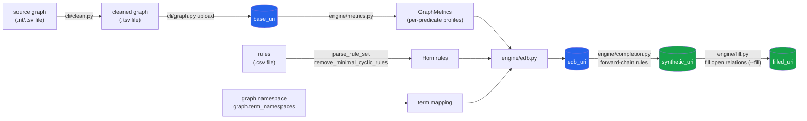
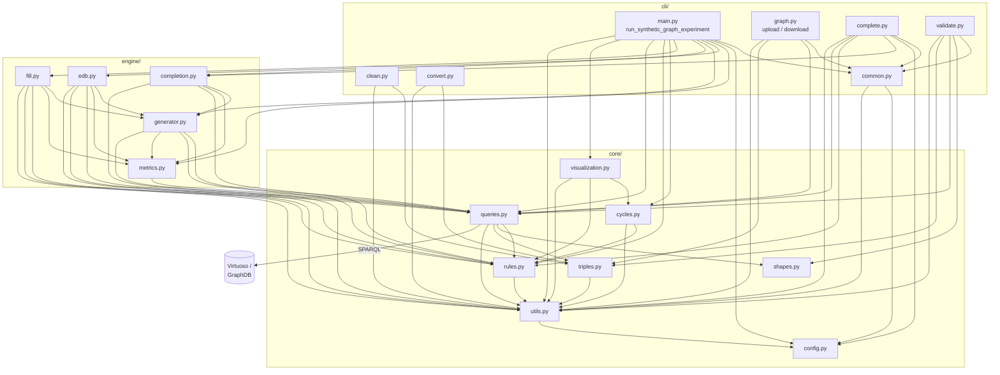

# Architecture

This page expands the module map in [`AGENTS.md`](../AGENTS.md) with diagrams and the reasons behind the design. [`concepts.md`](concepts.md) defines the domain terms used below (EDB/IDB, Horn rule, closure, predicate profile, ...), and [`algorithm.md`](algorithm.md) describes the method independently of the code.

## Data flow

The pipeline turns a source graph into a synthetic one in two stages. It first profiles the uploaded base graph, then builds a new graph from those profiles and the rule set alone. Once the profiles are extracted, the original graph is not read again.

```mermaid
flowchart LR
    RAW["source graph<br/>(.nt/.tsv file)"] -->|cli/clean.py| NT["cleaned graph<br/>(.tsv file)"]
    NT -->|"cli/graph.py upload"| BASE[("base_uri")]
    NS["graph.namespace<br/>graph.term_namespaces"] --> TERM["term mapping"]
    RULES["rules<br/>(.csv file)"] -->|"parse_rule_set<br/>remove_minimal_cyclic_rules"| HORN["Horn rules"]

    BASE -->|engine/metrics.py| METRICS["GraphMetrics<br/>(per-predicate profiles)"]

    METRICS & HORN & TERM --> EDBGEN["engine/edb.py"]
    EDBGEN --> EDB[("edb_uri")]

    EDB -->|"engine/completion.py<br/>forward-chain rules"| SYN[("synthetic_uri")]
    SYN -->|"engine/fill.py<br/>fill open relations (--fill)"| FILLED[("filled_uri")]

    style BASE fill:#2563eb,color:#fff
    style EDB fill:#2563eb,color:#fff
    style SYN fill:#16a34a,color:#fff
    style FILLED fill:#16a34a,color:#fff
```

Blue nodes are named graphs in the database, keyed by the URIs in each config's `graph` section. The green nodes are the graphs the pipeline delivers: `synthetic_uri` (EDB + completion), and `filled_uri` when the optional fill step runs (`--fill`).

1. Preparation (`cli/clean.py`, optional and local). The pipeline does not support literals yet, so this script writes a cleaned copy of a `.nt`/`.tsv` file as a `.tsv` file, cutting `.nt` IRIs to their last segment. It replaces every `/` in a term's own name with `_` (written as `%2F` inside an IRI's last segment) and fails if two terms clean to the same name. It drops duplicate triples, every non-type triple whose object is never typed (never the subject of a `type`/`rdf:type` triple), and every triple whose predicate is in `--literal-predicates` (default `name`). Type triples are kept unless `--drop-types` is given, which drops them all last, after checking that every subject is typed to the same single class. It logs a warning for every subject that is never typed; DEBUG lists each one. `cli/convert.py` only converts a file between `.nt` and `.tsv`, keeping literals, and builds its term mapping from `-f` or `--namespace` (`core/utils.load_term_mapping`). Neither script touches the database. Both read files through `core/triples.py`.
2. Upload (`cli/graph.py upload`). Loads a `.nt` or `.tsv` file (`graph.triple_file`) into `base_uri`, or into `--graph-uri` if given. `.tsv` rows are bare `subject\tpredicate\tobject` terms, resolved to full URIs through the term mapping before insertion (`core/triples.tsv_term_to_nt`, the same function `cli/convert.py` uses).
3. Metrics and rules (phase 1 of `cli/main.py`). `engine/metrics.py` profiles `base_uri` over SPARQL: per-predicate frequency, domain and range counts, reflexivity. These profiles are all the pipeline needs from the source graph. The rule set is then parsed (`core/rules.parse_rule_set`, which keeps only rules with std confidence 1, or with PCA confidence >= `rules.pca_threshold` when the config or `--pca-conf` sets one). `core/visualization.plot_relation_graph` writes the remaining rules' predicate dependency graph to `logs/relation_graph_<graph.name>.png`, with every predicate on a cycle drawn in red. The fewest [cyclic rules](concepts.md#cyclic-rule) that break every cycle are then removed, so the rule set the EDB and completion use has no cycle (see [Removing the fewest rules](algorithm.md#52-removing-the-fewest-rules) for the method and [Cyclic rule removal](#cyclic-rule-removal) below for the code).
4. EDB generation (phase 2). `engine/edb.py`'s `generate_extensional_predicates` fills `edb_uri` with triples for the extensional predicates (those no rule head produces) until each one reaches its target frequency. It applies three mechanisms in a fixed priority: `check_direct_matches` adds the triples the profiles force, `check_triples_from_rule` builds groundings of each rule's extensional body with `generator.sample_groundings` so the joins the rules need exist, and `insert_random_triples` spends the remaining budget with draws weighted by each entity's remaining count. See [section 3 of `algorithm.md`](algorithm.md#3-extensional-database-edb) for the method. `--skip-edb` skips this phase and reuses the triples already at `edb_uri`.
5. Completion (phase 3). `engine/completion.py`'s `complete_graph` copies `edb_uri` into `synthetic_uri`, then applies every rule on each pass and repeats until a pass adds nothing. It returns the number of triples added and takes a `label` for its log lines. Rules are not ordered, and `apply_rule` has no profile cap, so a rule can overshoot its head predicate's target frequency. The profiles passed to `complete_graph` are only used afterwards: `engine/generator.py`'s `get_closed_rules`/`get_closed_preds` check which rules reached their `support` and which predicates reached their `frequency`, and set their `closed` fields for reporting. Phase 5 logs the summary (see `cli/main.py` below). An earlier design, `engine/idb.py`'s `generate_idb`, ordered rules with the same head and checked upfront that every intensional predicate could be derived; it has been removed (see [Rule application order](concepts.md#rule-application-order)).
6. Filling open relations (phase 4, only with `--fill`). Completion can leave predicates short of their frequency and rules short of their support. `cli/main.py` copies `synthetic_uri` to `filled_uri`, and `engine/fill.py`'s `fill_open_predicates` adds the missing triples of each open predicate there, so `synthetic_uri` keeps the EDB + completion result. A rule-driven pass builds groundings that raise the support of open rules, then a random pass spends the budget left, drawing subjects and objects weighted by how many more triples they need to match their counts in `base_uri`. A triple is kept only if it leaves the support of every closed rule unchanged, keeps open rules within their target, and leaves no body grounding without its head (see [section 4.1 of `algorithm.md`](algorithm.md#41-filling-open-relations) and [Filling open relations](concepts.md#filling-open-relations)).

## Cyclic rule removal

`cli/main.py` calls `core/cycles.remove_minimal_cyclic_rules` right after `parse_rule_set`. It deletes rules from the rule dict in place and returns the removed ones, which the summary lists. The method is described in [section 5.2 of `algorithm.md`](algorithm.md#52-removing-the-fewest-rules). In the code (`core/cycles.py`):

1. `get_relation_graph` builds the relation graph as a `networkx.DiGraph`, each edge carrying the IDs of the rules behind it.
2. `_cyclic_components` splits it into strongly connected components (`nx.strongly_connected_components`) and yields each one with the rules that have an edge inside it (its subgraph's `rule_ids`). These are the cyclic rules, the candidates for removal; a component without such rules is skipped. `cycle_predicates` uses the same components to give the predicates that `plot_relation_graph` draws in red.
3. A component with more than `MAX_EXACT_COMPONENT_SIZE` (20) predicates logs a warning and loses all its candidates, since the exact selection keeps 2^n states for n predicates.
4. Otherwise `_best_order` runs the dynamic program on the component's predicates, sorted by URI. Each predicate gets a bit, each set of placed predicates is an integer bitmask, and each rule is stored under its head with the bitmask of its body predicates in the component. A rule whose bitmask contains its own head is recursive and never stored. `best[subset]` holds the best `(rule count, total support)` for that set, and `placed_last[subset]` the predicate placed last to reach it. Subsets are visited in increasing order, so every subset is final before it is extended, and a candidate replaces the stored value only if it is strictly larger: ties keep the first one found, which makes the result deterministic.
5. The order is read back from `placed_last`, starting at the full set. A rule is kept when every body predicate it has in the component comes before its head in that order.
6. `remove_minimal_cyclic_rules` logs the order and the number of rules kept per component, then each removed rule with its reason: `recursive`, or the body predicates placed after its head.
7. `_pop_rules` deletes the removed rules and logs which head predicates become extensional and which stay intensional through which rules.

## Components

```mermaid
flowchart TD
    subgraph cli ["cli/"]
        MAIN["main.py<br/>run_synthetic_graph_experiment"]
        GRAPH["graph.py<br/>upload / download"]
        COMPLETE["complete.py"]
        CLEAN["clean.py"]
        CONVERT["convert.py"]
        VALIDATE["validate.py"]
        COMMON["common.py"]
    end

    subgraph engine ["engine/"]
        METRICS["metrics.py"]
        EDB["edb.py"]
        GEN["generator.py"]
        COMPLETION["completion.py"]
        FILL["fill.py"]
    end

    subgraph core ["core/"]
        RULES["rules.py"]
        CYCLES["cycles.py"]
        SHAPES["shapes.py"]
        QUERIES["queries.py"]
        TRIPLES["triples.py"]
        VIS["visualization.py"]
        CONFIG["config.py"]
        UTILS["utils.py"]
    end

    DB[("Virtuoso /<br/>GraphDB")]

    MAIN --> COMMON & CONFIG & METRICS & EDB & GEN & COMPLETION & FILL & CYCLES & RULES & QUERIES & VIS & UTILS
    GRAPH --> COMMON & QUERIES & TRIPLES & UTILS
    COMPLETE --> COMMON & CONFIG & COMPLETION & RULES & QUERIES & UTILS
    VALIDATE --> COMMON & SHAPES & QUERIES & TRIPLES & UTILS
    CLEAN & CONVERT --> TRIPLES & UTILS
    COMMON --> CONFIG & UTILS

    EDB --> GEN & METRICS & RULES & QUERIES & UTILS
    COMPLETION --> GEN & METRICS & RULES & QUERIES
    FILL --> GEN & METRICS & RULES & QUERIES & UTILS
    GEN --> QUERIES & RULES & METRICS & UTILS
    METRICS --> QUERIES
    CYCLES --> RULES & UTILS
    VIS --> CYCLES & RULES & UTILS
    QUERIES --> RULES & SHAPES & TRIPLES & UTILS
    TRIPLES --> UTILS
    RULES --> UTILS
    UTILS --> CONFIG

    QUERIES -->|SPARQL| DB
```

`clean.py` and `convert.py` only read and write local files. Every other script reaches the database through `core/queries.py`.

### `core/`

- `config.py`: `RunConfig` and its sub-configs (dataclasses), loaded from `configurations/*.json`. Loading a config raises `FileNotFoundError` if `data.input_dir` does not exist. LoRA fine-tuning and Chain-of-Thought dataset generation are not implemented under `src/` yet; their placeholder `FineTuningConfig`/`CoTGenerationConfig` dataclasses were removed as dead code.
- `utils.py`: logging setup (`setup_logging`), config lookup under `configurations/` (`resolve_config_path`), SPARQL client construction from a `RunConfig` (`create_sparql_client`) or from explicit connection settings (`build_sparql_client`, used by `cli/complete.py`), and term handling. `build_term_mapping` merges `graph.term_namespaces` over `DEFAULT_PREFIXES` under the `graph.namespace` default (`config_term_mapping` does it for a `RunConfig`), `load_term_mapping` builds the same mapping from `-f`/`--namespace` for the local-file scripts, `format_term`/`format_triple` turn bare terms into N-Triples, and `short_term` cuts a URI to its last segment.
- `rules.py`: the `Atom`/`RuleSignature`/`HornRule` dataclasses and CSV parsing into a rule set (`parse_rule_set`, keyed by the CSV's `rule_id` column; `rule_sort_key` orders those IDs numerically). `get_extensional_dependencies` gives the "more restrictive rule first" order that EDB generation uses ([`algorithm.md` §3.2.2](algorithm.md#322-mechanism-2-rule-driven-grounding)). `get_impacted_rules` lists the rules a new triple of a predicate can affect, for the fill step.
- `cycles.py`: `get_relation_graph` builds the predicate dependency graph of a rule set, `cycle_predicates` gives the predicates on a cycle of it, and `remove_minimal_cyclic_rules` removes the fewest rules that leave it with no cycle (see [Cyclic rule removal](#cyclic-rule-removal) above and [Cyclic rule](concepts.md#cyclic-rule)).
- `queries.py`: builds and runs every SPARQL query. No other module calls `SPARQLWrapper` directly to read or write. SELECTs are sent as URL-encoded POST requests, because `get_existing_triples` builds queries with large `VALUES` clauses that can exceed the store's maximum URL or header size for GET. `initialize_graph` clears a graph and fills it from another graph URI or a `.nt`/`.tsv` file, reading `.tsv` files through `core/triples.py`. `insert_triples_bulk` and `export_graph_nt` move whole graphs in and out as N-Triples: on GraphDB through the repository's `/statements` REST endpoint, and on Virtuoso through its Graph Store endpoint for uploads and through sorted, paged CONSTRUCT queries for downloads, because Virtuoso's Graph Store endpoint returns at most `ResultSetMaxRows` triples. `TripleBuffer` wraps `insert_triples_sparql` to collect triples that were decided without a database read (`engine/edb.py`'s direct matches and random assignment) and insert them in fewer, larger batches.
- `shapes.py`: `load_shapes` reads the `sh:sparql` constraints of a `<dataset>.shapes.ttl` file into `SparqlConstraint`s (shape, `sh:message`, `sh:select`, targets, prefixes), parsing only that file with rdflib. `triples_in_row` reads the triples a result row names (`?this ?path ?value`, `?this2 ?path2 ?value2`, ...). `core/queries.build_shape_query` turns a constraint into a query over one named graph.
- `triples.py`: local `.nt`/`.tsv` files, with no database. `read_nt`/`read_tsv` yield each line's triple with its line number, or `None` for a line that isn't one, and the caller decides whether to skip it with a warning (`convert`) or fail (`clean`, `validate`, `queries.insert_graph`). `tsv_term_to_nt` turns a bare `.tsv` term into an IRI (percent-encoding the characters N-Triples forbids, `%`, `/` and `#`) and `nt_term_to_tsv` does the reverse. `convert` converts a whole file; `cli/convert.py` and `cli/graph.py download` call it. Every script that turns a `.tsv` file into IRIs goes through `tsv_term_to_nt`, so a term becomes the same IRI whether it is uploaded, validated or converted.
- `visualization.py`: `plot_relation_graph` renders a predicate dependency graph to a PNG with `matplotlib` (`Agg` backend, so it runs without a display), coloring the predicates on a cycle (`core/cycles.cycle_predicates`) red and labeling each edge with its rule IDs.

### `engine/`

- `metrics.py`: `GraphMetrics`/`PredicateProfile`, the topological descriptors of the source graph. `GraphMetrics.from_uri` computes them over SPARQL and dumps them to `logs/metrics/` for debugging.
- `generator.py`: triple-generation code shared by the other engine modules. `sample_groundings` builds groundings of a rule's extensional body directly from the predicate profiles, without materializing a cartesian product; `engine/edb.py` uses it. `apply_rule` applies one rule, querying the graph for bindings, and inserts every new head triple: the head predicate's profile doesn't cap it. `get_closed_rules`/`get_closed_preds` check over SPARQL whether a rule or predicate reached its `support` or `frequency` target. `sample_grounding_groups` returns the same groundings one list of triples each, which `fill.py` needs to accept or reject a grounding as a whole; `sample_groundings` flattens them.
- `edb.py`: EDB generation, step 4 of "Data flow" above.
- `completion.py`: `complete_graph`, step 5 of "Data flow" above. `cli/complete.py` also uses it on real graphs.
- `fill.py`: `fill_open_predicates`, step 6 of "Data flow" above. `_FillState` holds the remaining budget per open predicate (source counts minus synthetic counts, as `PredicateProfile`s) and the support of every kept rule, tracked in memory as triples are inserted. `_FillState.impact` checks one triple with `core/queries.build_head_impact_query` and `build_body_impact_query`/`get_new_head_bindings` for every kept rule its predicate occurs in, and returns the support each open rule would gain or why the triple is rejected. `_FillState.insert_group` inserts a grounding one triple at a time, so the checks of later triples see the earlier ones, and deletes the inserted ones again (`core/queries.delete_triples_sparql`) if one is rejected. `classify_open_rule` sorts open rules into cases A, B1 and B2; `_fill_rule` runs the rule-driven pass for one rule with `generator.sample_grounding_groups`, joined with `core/queries.get_unsupported_head_bindings` (B1) or `get_atom_bindings` (B2); `_fill_predicate` runs the random pass for one predicate.

### `cli/`

- `main.py`: the experiment entry point (`run_synthetic_graph_experiment`, or `python -m skgg.cli.main -f <config>`). Before generating the EDB, it writes the rules left after the confidence filter and `remove_minimal_cyclic_rules` to `<rules_file stem>_used.csv` next to the rules file. Phase 1 ends by logging the extensional and intensional relations with their target frequencies, and `engine/edb.py` logs the relations warm-up added triples to and the extensional relations left to generate. At the start of phase 3 and after the completion, `_ClosureProgress.log` logs the number of closed predicates and rules, the ones that closed since the previous check, and each open extensional and intensional predicate's current frequency against its target. Phase 3 lists the rules it applies, and `complete_graph` logs the triples each rule added per pass and in total. Phase 4, `log_summary`, logs one report comparing the synthetic graph with the original: total triples, one row per predicate (frequency original -> synthetic, `[OPEN]`/`[CLOSED]`, and `[EXTENSIONAL]`/`[INTENSIONAL]`, where intensional means some rule has the predicate as its head), one row per rule (support original -> synthetic, `[OPEN]`/`[CLOSED]`), and then the rules `remove_minimal_cyclic_rules` removed, with their support only. URIs are shortened to their last segment and each rule is printed as `body => head`. `--fill` runs phase 4 on a copy of `synthetic_uri` at `filled_uri`; without it phase 4 is skipped and the summary compares `base_uri` with `synthetic_uri`.
- `graph.py`: moves a named graph between a local file and the database. `upload` loads a `.nt`/`.tsv` file into `base_uri`, or into `--graph-uri` if given (`python -m skgg.cli.graph upload -f <config>`), and runs no rule-based completion. `download` writes a named graph to `<output>.nt` and `<output>.tsv` (`python -m skgg.cli.graph download -f <config> [--graph-uri <uri>] [-o <output>]`), with `core/queries.export_graph_nt` for the `.nt` and `core/triples.convert` for the `.tsv`. It fails if the `.nt` has a different number of triples than the graph.
- `complete.py`: completes a real graph with a rule set (`python -m skgg.cli.complete [-f <config>] [--complete-uri <uri>]`). It copies a graph URI or a `.nt`/`.tsv` file into `--complete-uri` (default `graph.base_uri`) and runs `complete_graph` on it until a pass adds nothing. If the source is `--complete-uri`, it is completed in place without a copy. Settings come from a config, from flags (including the database connection), or both. It uses no profiles and removes no cyclic rule.
- `validate.py`: reports the triples of a graph that violate a SHACL-SPARQL shapes file (`python -m skgg.cli.validate -f <config> [--source <uri|file.tsv>] [--shapes <file>] [--graph-uri <uri>] [-o <report>] [--keep-graph]`). The source defaults to the config's `graph.base_uri`, which is queried in place. A `.tsv` source is loaded into a temporary named graph that is cleared after the check. It runs every constraint with `build_shape_query` and writes a `.violations.tsv` report with the line number (`.tsv` sources only), terms, shape and message of each flagged triple.
- `clean.py`: writes a cleaned `.tsv` copy of a `.nt`/`.tsv` file, step 1 of "Data flow" above.
- `convert.py`: converts a triples file from `.nt` to `.tsv` or back with `core/triples.convert`, dropping only duplicate triples and lines that are not a triple. Literals are kept; in the `.tsv` a literal becomes its bare text.
- `common.py`: not a script. `add_config_args` adds the `-f`/`--config-file` and `--log-level` options that `main.py`, `graph.py`, `validate.py` and `complete.py` share, and `load_config` loads the config they name and sets up logging.

## Known rough edges

See [`BACKLOG.md`](../BACKLOG.md) for the current list.
