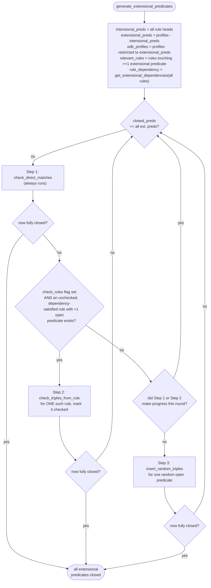

# EDB generation

How `engine/edb.py`'s `generate_extensional_predicates` turns predicate profiles + Horn rules into the ground triples of the Extensional Database (EDB), the seed `engine/completion.py` (with `engine/cycles.py`) later grows into the synthetic graph. See [`concepts.md`](concepts.md) for EDB/IDB, predicate profile, closure and grounding-sampler definitions used throughout, and [`architecture.md`](architecture.md) for where this step sits in the overall pipeline.

## Goal and constraints

`generate_extensional_predicates` never invents predicates from scratch: it materializes ground triples only for **extensional predicates** (`profiles.keys() - {every rule'shead predicate}`), i.e., predicates a rule never derives, whether because they only ever occur in a rule *body* or because they don't appear in the rule set at all. Every other predicate (**intensional**) is left for `engine/completion.py` to derive later by forward-chaining (with `engine/cycles.py` seeding any stale cycle completion alone could never start).

For each extensional predicate, the EDB must reproduce, exactly, the `PredicateProfile` extracted from the source graph: the same `frequency` (triple count), and the same `domain`/`range` degree distributions (i.e., how many triples each subject/object appears in). A triple is only ever added if its subject still has domain budget left and its object still has range budget left for that predicate.

That alone would let us fabricate triples predicate-by-predicate, independently. But rule bodies join multiple predicates on shared variables (e.g. `t(X,Y) ← p(Z,X) ∧ q(Z,Y)`), and the synthetic graph completion depends on those joins actually having matching bindings once it applies the rules. So EDB generation has to pick *correlated* triples across predicates that co-occur in a rule body, not just triples that are individually profile-valid. That is what "selectivity" means, and it's the reason for the rule-body-driven Step 2 below.

## Restrictiveness and the extensional dependency graph

A rule body is **more restrictive** the more atoms with open extensional predicates it has. More atoms means more join constraints, so fewer candidate triples satisfy it. Ties are broken by support: given equal extensional-atom counts, the rule with *lower* support is more restrictive, since it has fewer witnessing bindings to find.

If two rules share an extensional predicate and one is more restrictive, the less restrictive one must wait: satisfying it first could greedily consume subjects/objects that were the *only* way to satisfy the more restrictive rule's join, leaving that rule permanently short of its support. So the less restrictive rule is made to **extensionally depend on** the more restrictive one, and Step 2 (below) only ever considers a rule once everything it depends on has already been processed.

This dependency graph is built once, over **all** rules (not just the ones that end up relevant to EDB generation), by `core.rules.get_extensional_dependencies`. (It is noted in the backlog that this may impact execution times):

1. Compute `intensional_preds` = every rule's head predicate.
2. Sort all rule IDs ascending by the number of *extensional* atoms in their body (`RuleSignature.get_extensional_body`) — least restrictive first.
3. For each rule `current` in that order, compare it against every rule `next` that comes after it in the sort (so `next`'s extensional-atom count is `>=` `current`'s):
   - Skip `next` if they share no extensional predicate — no dependency needed.
   - Otherwise, whichever of the two is **more restrictive** becomes the dependency (`next` depends on `current` in the general case, since `next` has at least as many extensional atoms; but if the two counts are *equal* and `next.support > current.support`, `current` is the more restrictive one and the dependency direction flips: `next` depends on `current`).

The result is `rule_dependency: {rule_id -> set of rule_ids it must wait for}`.

**Worked example** (the one from the introduction): `r1: t1(X,Y) ← p(Z,X) ∧ q(Z,Y)` (2 extensional atoms), `r2: t2(X,Y) ← p(X,Y)` (1 extensional atom). Sorted order is `[r2, r1]`. Comparing `r2` against `r1`: they share predicate `p`, and `r1` has strictly more extensional atoms, so `r2` depends on `r1` — `r1`'s triples for `p` must be selected first.

## The generation loop

Each pass through the loop is one "step" (`step` counter in the logs). A predicate is **closed** once its `PredicateProfile.frequency` reaches 0, which `generator.update_closed_preds` records by setting that profile's `closed` field to `True`; `edb_profiles` is mutated in place throughout — every accepted triple decrements the relevant subject's domain count, the object's range count, and the predicate's frequency (`generator.decrement_counts`). Any `closed_preds` set seen in `generate_extensional_predicates` (or in `check_triples_from_rule`) is a short-lived set comprehension derived from `PredicateProfile.closed`, not persisted state; rule closure (`HornRule.closed`) is likewise set directly on the rule object rather than collected into a set — see [`concepts.md`](concepts.md#closure).

Three bookkeeping details that shape the loop's behavior and are easy to miss reading the summary alone:

- **Steps 1 and 3 buffer their triples instead of inserting them immediately.** Both decide every triple purely from the in-memory `PredicateProfile` domain/range dicts — no DB read is ever needed to produce them — so `generate_extensional_predicates` hands them a shared `TripleBuffer` (`core/queries.py`) instead of calling `insert_triples_sparql` directly. The buffer auto-flushes once it reaches `chunk_size` triples (`flush_if_full`), is flushed unconditionally right before Step 2 runs (see below — Step 2 reads `edb_uri` and needs every prior triple actually visible), and is flushed once more, unconditionally, right before `generate_extensional_predicates` returns. Step 2 itself is unaffected: its triples require a query to decide, so it keeps inserting immediately as before.

- **Step 2 processes at most one rule per round**, and once a rule has been passed to `check_triples_from_rule` (successfully or not) it is added to `checked_rules` and **never retried**, even if it produced zero triples — a single call is expected to fully exploit that rule's contribution to the EDB. `check_rules` flips to `False` once every relevant rule has been checked once, after which Step 2 is skipped for the rest of the run.
- A rule is only *offered* to `check_triples_from_rule` once its body has **more than one** extensional-predicate atom (`len(r.get_extensional_body(intensional_preds)) > 1` — this counts every extensional atom in the body, regardless of whether that predicate is already closed). With one or zero extensional atoms there's nothing for the join query to correlate, so the rule is immediately marked `checked` and left alone for good: with zero extensional atoms there's nothing left for this rule to contribute to the EDB at all, and with exactly one, that predicate's remaining triples are just picked up through ordinary direct-match/random assignment (Steps 1/3) instead — no join needed.
- `relevant_rules` (rules touching at least one extensional predicate) is scanned in whatever order `rules` was loaded in (CSV row order), *not* sorted by restrictiveness — the `rule_dependency` gate (`rule_dependency[r_id] - checked_rules` must be empty) is what actually enforces more-restrictive-first processing regardless of scan order: a less restrictive rule simply isn't "ready" until everything it depends on is checked.

## Step 1: Direct assignments (`check_direct_matches`)

For every open predicate, this looks for subjects/objects whose remaining degree exactly matches the number of alternatives still available — the "forced" case from the summary — and assigns all of them at once:

- For each subject `s` with remaining domain count `f` in predicate `p`'s profile: let `obj_choices` = the predicate's remaining range keys, minus `s` itself (so a forced pass never manufactures a self-loop). If `f == len(obj_choices)`, every one of those objects *must* pair with `s` — any other choice would leave some other subject with more remaining demand than there are distinct objects left to satisfy it. Emit `p(s, o)` for every `o` in `obj_choices`, decrementing each object's range count and the predicate's frequency, then drop `s` from the domain entirely (it's fully assigned).
- Symmetrically for each object with remaining range count matching its available subjects.

This directly implements the summary's example: predicate `p` with `D_p = {X: 2, Y: 1}`, `R_p = {W: 2, Z: 1}` — subject `X`'s remaining count (2) equals its number of available objects (`{W, Z}`, since `Y` isn't a candidate object here), so `X` is forced to pair with *both* `W` and `Z` in the same pass, rather than greedily picking just `p(X, W)` or `p(X, Z)` and risking a later dead end.

Because closing one subject/object can make another one newly forced, the function loops internally until a full pass finds nothing left to force, before returning. It is also re-run at the top of *every* round of the outer loop, so triples added by Steps 2 or 3 immediately get a chance to cascade into new forced assignments before those steps run again.

## Step 2: Rule-body–driven selection (`check_triples_from_rule`)

For the one ready rule chosen this round:

1. **Restrict to open work**: `new_body` = the rule's body atoms whose predicate is extensional and not yet closed. If empty, this rule has nothing left to contribute — return immediately (still counts as "checked").
2. **Sample groundings** (`generator.sample_groundings`): compute `missing_heads = rule.support - producible_heads`, where `producible_heads` (`queries.count_producible_heads`) counts the distinct head bindings the rule's extensional body already yields from triples in the EDB, then construct only that many groundings of `new_body` directly from the profiles, in batches:
   - Each variable's candidate pool is the intersection of the profile positions it occupies (domain keys for subjects, range keys for objects), weighted by remaining capacity. Variables shared between atoms (e.g. `?Z` in `p(Z,X)` and `q(Z,Y)`) are drawn once per grounding, so the atoms connect the way the rule requires — this is what recovers the "selectivity between triples that appear together in a rule's body"; sampling each predicate independently would lose it. An empty pool raises `ValueError` (the rule can't be satisfied under the profiles).
   - Support counts *distinct projections onto the head variables*, so a grounding is accepted only if its head projection is new. Body-only (existential) variables add no support: one witness per head tuple is enough, and capacity-weighted draws favor reusing high-capacity entities.
   - A grounding whose triples all already exist in the EDB adds nothing (its projection is already among the `producible_heads`) and is rejected. Otherwise every novel triple must pass profile checks: the predicate still has frequency left, the subject is still in its domain, the object is still in its range, and `is_assignment_solvable` (below) still holds. If any atom fails, the tentative decrements are undone and the grounding is rejected.
   - Sampling stops at `missing_heads` accepted groundings, or after three consecutive batches with no accepted grounding (a warning is logged; step 3 covers the remainder).
3. For every accepted grounding, one triple is emitted per `new_body` atom, and the profiles are decremented accordingly before insertion.

### The solvability check (`generator.is_assignment_solvable`)

This is the formal version of the summary's ad hoc "don't leave a subject needing more objects than exist" rule — a Gale–Ryser/Havel–Hakimi–style realizability check for a bipartite degree sequence with no repeated edges, applied to one candidate `(subject, object)` pair at a time. After *simulating* the decrement (without mutating the real profile):

- `s_domain_len` / `s_range_len` — how many distinct subjects/objects would remain available afterward (a subject/object drops out once its count would hit 0).
- `max_domain_freq` / `max_range_freq` — the largest remaining demand on any subject/object afterward.

The assignment is accepted only if `max_domain_freq <= s_range_len` **and** `max_range_freq <= s_domain_len` — i.e. no subject is left needing more distinct objects than remain, and no object is left needing more distinct subjects than remain. This is checked, and can reject a candidate, *before* any triple derived from it is committed — which is exactly what the naive `p(Y, Z)` example in the summary was missing.

## Step 3: Random assignment (`insert_random_triples`)

Only reached when a round makes no progress from Steps 1–2 (every relevant rule already checked or gated, and no forced direct matches left). The outer loop first picks a uniformly random still-open predicate; within it:

1. Pick a uniformly random subject from the predicate's remaining domain. That subject's remaining domain count `required_count` is *not* optional — since there's no more forcing logic left to consume it later, this subject must be fully closed in this one pass.
2. If fewer objects remain in the range than `required_count`, the profile is unsatisfiable at this point — raise `ValueError`.
3. Repeatedly sample `required_count` distinct objects at random and simulate the same two-sided realizability check as `is_assignment_solvable`, but batched over the whole set of `required_count` triples at once (since they're all committed together): the largest remaining domain demand (excluding this now-closed subject) must fit within the number of objects that would still remain, and the largest remaining range demand afterward must fit within the number of subjects that would still remain. Resample and retry until a valid set is found.
4. Commit: decrement the predicate's frequency by `required_count`, drop the subject from the domain (fully assigned), decrement each chosen object's range count, and emit the triples.

Because this step ignores rule bodies entirely, it's deliberately the last resort — it only runs once Steps 1–2 have already extracted everything that preserves rule co-occurrence, so there's nothing left to lose by picking the rest of a predicate's triples without regard to any rule.

## Termination

The outer loop's only success condition is every extensional predicate's `closed` field being set; there's no separate "give up" branch. In practice, either progress is made every round until closure, or `check_triples_from_rule` / `insert_random_triples` raises (`TimeoutError` / `ValueError`) when the profiles+rules turn out to be jointly unsatisfiable. One residual edge case: if a predicate's domain is emptied out from under it (e.g. Step 3 warns and returns 0 rather than raising, which happens if `insert_random_triples` is handed a predicate whose domain is already empty), that round records no progress but doesn't raise either — the loop simply retries, and since nothing about that predicate's state can change without a triple being added to it, this can spin without making further progress. This hasn't been observed against the checked-in configurations but is worth knowing about before trusting the algorithm against a new, untested rule set.

## Step ↔ code reference

| Step | Function | Module |
|---|---|---|
| Dependency graph | `get_extensional_dependencies` | `core/rules.py` |
| 1. Direct assignments | `check_direct_matches` | `engine/edb.py` |
| 2. Rule-body selection | `check_triples_from_rule` | `engine/edb.py` |
| 2. Grounding sampler | `sample_groundings` | `engine/generator.py` |
| 2/3. Realizability check | `is_assignment_solvable` | `engine/generator.py` |
| 3. Random assignment | `insert_random_triples` | `engine/edb.py` |
| 1/3. Insertion buffering | `TripleBuffer` | `core/queries.py` |
| Orchestration | `generate_extensional_predicates` | `engine/edb.py` |
